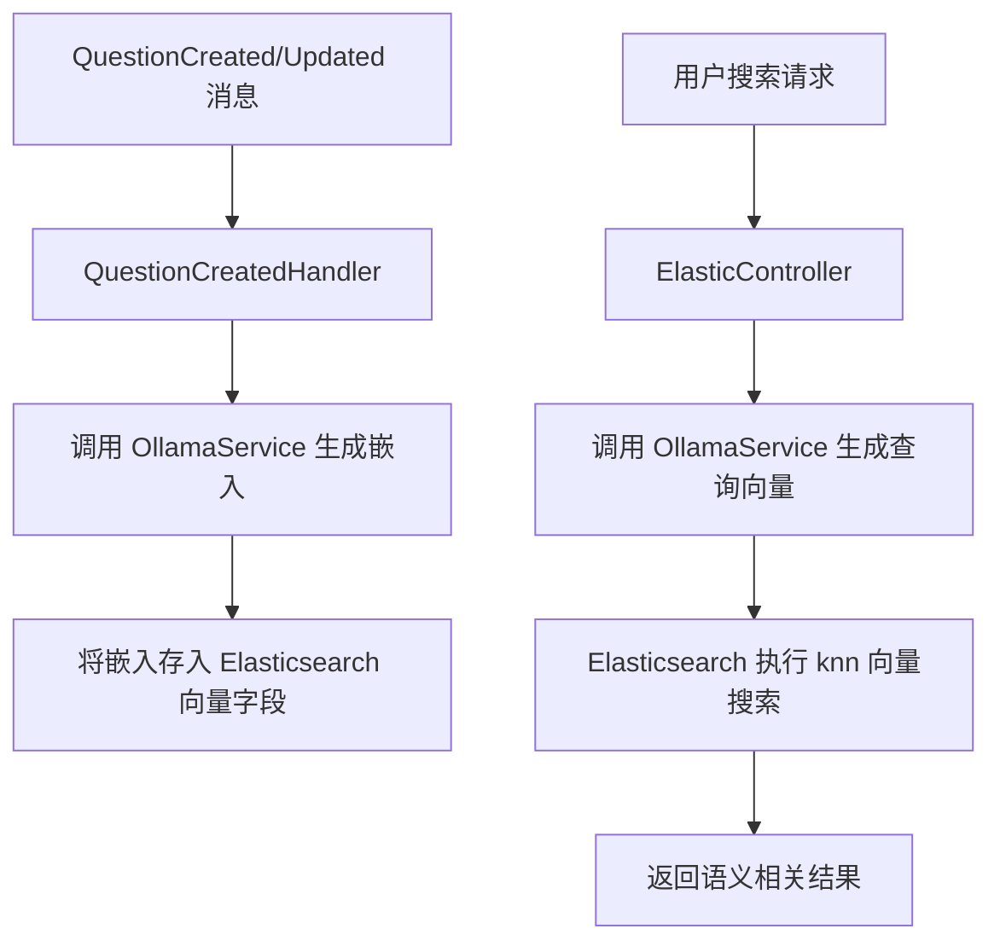

# 基于 bge-large 的中文语义搜索完整方案

您的项目已经搭建了 Elasticsearch 和 Ollama（含 bge-large 模型）的基础设施，并实现了基于文本分词的常规搜索。本文档将指导您扩展系统，实现基于向量的**语义搜索**，使搜索结果能理解用户意图，而不仅仅是关键词匹配。

---

## 整体架构



---

## 一、Elasticsearch 索引映射配置

需要为 `questions` 索引增加一个 `dense_vector` 字段，用于存储文档的嵌入向量。  
推荐使用 **`ElasticsearchIndexInitializer`**（您已存在）在应用启动时自动创建或更新映射。

### 1.1 定义带向量字段的文档模型

修改 `ElasticQuestion` 类，增加 `Embedding` 属性（注意不需要在 JSON 序列化中暴露，但索引时需要）：

```csharp
using System.Text.Json.Serialization;
using Elastic.Clients.Elasticsearch;

namespace ElasticsearchService.Models;

public class ElasticQuestion
{
    [JsonPropertyName("id")]
    public required string Id { get; set; }
    
    [JsonPropertyName("title")]
    public required string Title { get; set; }
    
    [JsonPropertyName("content")]
    public required string Content { get; set; }
    
    [JsonPropertyName("tags")]
    public List<string> Tags { get; set; } = [];
    
    [JsonPropertyName("createdAt")]
    public DateTimeOffset CreatedAt { get; set; }
    
    [JsonPropertyName("hasAcceptedAnswer")]
    public bool HasAcceptedAnswer { get; set; }
    
    [JsonPropertyName("answerCount")]
    public int AnswerCount { get; set; }
    
    // 向量字段，不在 _source 中存储（节省空间），仅用于索引
    [PropertyName("embedding")]
    public float[]? Embedding { get; set; }
}
```

### 1.2 创建索引映射（使用 Initializer）

在 `ElasticsearchIndexInitializer` 中添加创建索引时指定映射：

```csharp
public class ElasticsearchIndexInitializer : IHostedService
{
    private readonly ElasticsearchClient _client;
    private readonly ILogger<ElasticsearchIndexInitializer> _logger;

    public ElasticsearchIndexInitializer(ElasticsearchClient client, ILogger<ElasticsearchIndexInitializer> logger)
    {
        _client = client;
        _logger = logger;
    }

    public async Task StartAsync(CancellationToken cancellationToken)
    {
        var indexName = "questions";
        var existsResponse = await _client.Indices.ExistsAsync(indexName, cancellationToken);
        
        if (!existsResponse.IsValidResponse || !existsResponse.Exists)
        {
            var createResponse = await _client.Indices.CreateAsync(indexName, c => c
                .Settings(s => s
                    .NumberOfShards(1)
                    .NumberOfReplicas(0)
                    .Analysis(a => a
                        .Analyzers(an => an
                            .Custom("ik_smart", cus => cus
                                .Tokenizer("ik_smart")
                            )
                        )
                    )
                )
                .Mappings(m => m
                    .Properties(p => p
                        .Keyword(k => k.Id)
                        .Text(t => t.Title, txt => txt.Analyzer("ik_smart"))
                        .Text(t => t.Content, txt => txt.Analyzer("ik_smart"))
                        .Keyword(k => k.Tags)
                        .Date(d => d.CreatedAt)
                        .Boolean(b => b.HasAcceptedAnswer)
                        .Integer(i => i.AnswerCount)
                        // 向量字段配置
                        .DenseVector(dv => dv
                            .Embedding
                            .Dims(1024)          // bge-large 输出维度为 1024
                            .Index(true)
                            .IndexOptions(Elastic.Clients.Elasticsearch.Mapping.VectorIndexOptions.Default) // 默认 HNSW
                            .Similarity(VectorSimilarity.Cosine) // 余弦相似度
                        )
                    )
                )
            );
            
            if (!createResponse.IsValidResponse)
                _logger.LogError("创建索引失败: {DebugInfo}", createResponse.DebugInformation);
            else
                _logger.LogInformation("索引 'questions' 创建成功（含向量字段）");
        }
        else
        {
            _logger.LogInformation("索引 'questions' 已存在，跳过创建");
        }
    }

    public Task StopAsync(CancellationToken cancellationToken) => Task.CompletedTask;
}
```

> **注意**：bge-large 模型输出维度为 1024，请根据实际模型确认维度（您使用的 bge-large 默认为 1024）。如果您的 Ollama 模型是 `bge-large`，其维度可能是 1024，也支持 768 等版本，请核对。

---

## 二、在索引文档时生成并存储嵌入

修改现有的三个消息处理器（`QuestionCreatedHandler`、`QuestionUpdatedHandler`），在索引/更新文档前调用 Ollama 服务生成标题+内容的嵌入向量。

### 2.1 添加 Ollama HTTP 客户端（或通过服务调用）

推荐在 `ElasticsearchService` 中注入一个 `IEmbeddingGenerator` 服务，通过 HttpClient 调用 Ollama API。  
**方式一：直接使用 `OllamaSharp`**（您已有 `OllamaService`，但那是独立进程，我们可直接从 ElasticsearchService 中调用 Ollama API）

安装 NuGet 包：`OllamaSharp`（如果还没引用）

在 `Program.cs` 中注册：

```csharp
// 注册 Ollama 客户端（指向 Ollama 容器地址，假设容器内名称为 "Ollama"，端口 11434）
builder.Services.AddSingleton<IOllamaApiClient>(sp => 
    new OllamaApiClient(new Uri("http://Ollama:11434")));
builder.Services.AddScoped<IEmbeddingService, EmbeddingService>();
```

创建 `EmbeddingService`（与您 `OllamaService` 中的类似，但此处直接调用，避免跨服务调用开销）：

```csharp
public interface IEmbeddingService
{
    Task<float[]> GenerateEmbeddingAsync(string text);
    Task<List<float[]>> GenerateEmbeddingsAsync(List<string> texts);
}

public class EmbeddingService : IEmbeddingService
{
    private readonly IOllamaApiClient _ollama;

    public EmbeddingService(IOllamaApiClient ollama)
    {
        _ollama = ollama;
    }

    public async Task<float[]> GenerateEmbeddingAsync(string text)
    {
        var response = await _ollama.EmbedAsync(new EmbedRequest
        {
            Model = "bge-large",
            Input = new[] { text }
        });
        return response.Embeddings.FirstOrDefault() ?? Array.Empty<float>();
    }

    public async Task<List<float[]>> GenerateEmbeddingsAsync(List<string> texts)
    {
        var response = await _ollama.EmbedAsync(new EmbedRequest
        {
            Model = "bge-large",
            Input = texts
        });
        return response.Embeddings;
    }
}
```

> **注意**：为减少 Ollama 调用次数，可将标题和内容合并为一段文本（如 "标题：{Title}\n内容：{Content}"）生成单一向量，也可分别生成后拼接或平均。通常建议合并生成，以保留整体语义。

### 2.2 修改消息处理器

以 `QuestionCreatedHandler` 为例：

```csharp
public class QuestionCreatedHandler
{
    private readonly IEmbeddingService _embeddingService;
    private readonly ILogger<QuestionCreatedHandler> _logger;

    public QuestionCreatedHandler(IEmbeddingService embeddingService, ILogger<QuestionCreatedHandler> logger)
    {
        _embeddingService = embeddingService;
        _logger = logger;
    }

    public async Task HandleAsync(QuestionCreated message, ElasticsearchClient client)
    {
        // 生成嵌入
        var combinedText = $"标题：{message.Title} 内容：{StripHtml(message.Content)}";
        var embedding = await _embeddingService.GenerateEmbeddingAsync(combinedText);
        
        var doc = new ElasticQuestion
        {
            Id = message.QuestionId,
            Title = message.Title,
            Content = StripHtml(message.Content),
            CreatedAt = message.Created,
            Tags = message.Tags,
            Embedding = embedding
        };

        var response = await client.IndexAsync(doc, idx => idx.Index("questions").Id(message.QuestionId));
        if (!response.IsValidResponse)
            _logger.LogError("索引失败: {DebugInfo}", response.DebugInformation);
        else
            _logger.LogInformation("创建 {Title} 成功，嵌入已存储", doc.Title);
    }

    private static string StripHtml(string content) => Regex.Replace(content, "<.*?>", string.Empty);
}
```

同样修改 `QuestionUpdatedHandler`，更新时也重新生成向量：

```csharp
public async Task HandleAsync(QuestionUpdated message, ElasticsearchClient client)
{
    var combinedText = $"标题：{message.Title} 内容：{StripHtml(message.Content)}";
    var embedding = await _embeddingService.GenerateEmbeddingAsync(combinedText);
    
    var response = await client.UpdateAsync<ElasticQuestion, object>("questions", message.QuestionId, u => u
        .Doc(new ElasticQuestion
        {
            Title = message.Title,
            Content = StripHtml(message.Content),
            Tags = message.Tags,
            Embedding = embedding  // 更新向量
        })
    );
    // ... 日志处理
}
```

---

## 三、实现语义搜索接口

### 3.1 新增语义搜索端点（保留原有文本搜索）

在 `ElasticController` 中添加新方法：

```csharp
[HttpGet("semantic")]
public async Task<IActionResult> SemanticSearch([FromQuery] string query, [FromQuery] int size = 10)
{
    if (string.IsNullOrWhiteSpace(query))
        return BadRequest("查询词不能为空");

    // 1. 生成查询向量
    var queryEmbedding = await _embeddingService.GenerateEmbeddingAsync(query);
    
    // 2. 构建 knn 搜索请求（Elastic 8.x 支持 knn 查询）
    var searchRequest = new SearchRequest<ElasticQuestion>("questions")
    {
        Size = size,
        Knn = new KnnQuery
        {
            Field = "embedding",
            QueryVector = queryEmbedding,
            K = size * 2,          // 召回更多候选（用于后续 rerank，若需要）
            NumCandidates = size * 10
        }
    };

    try
    {
        var response = await _client.SearchAsync<ElasticQuestion>(searchRequest);
        if (!response.IsValidResponse)
            return Problem("语义搜索失败", response.DebugInformation);

        // 返回匹配的文档（已包含相关度得分）
        return Ok(response.Documents);
    }
    catch (Exception ex)
    {
        return Problem("语义搜索异常", ex.Message);
    }
}
```

### 3.2 混合搜索（可选）

结合文本匹配和向量搜索，提高精确度。例如使用 `bool` 查询 + `knn`：

```csharp
var boolQuery = new BoolQuery
{
    Should = new List<Query>
    {
        new MultiMatchQuery { Fields = new[] { "title^3", "content" }, Query = query, Analyzer = "ik_smart" }
    }
};

var searchRequest = new SearchRequest<ElasticQuestion>("questions")
{
    Query = boolQuery,
    Knn = new KnnQuery { Field = "embedding", QueryVector = queryEmbedding, K = size, NumCandidates = size * 10 },
    Size = size
};
```

### 3.3 基于标签的过滤（扩展）

您原有的 `[tag]` 过滤逻辑同样可以应用于语义搜索。只需在 `knn` 查询中结合 `filter`：

```csharp
var searchRequest = new SearchRequest<ElasticQuestion>("questions")
{
    Size = size,
    Knn = new KnnQuery
    {
        Field = "embedding",
        QueryVector = queryEmbedding,
        K = size,
        NumCandidates = size * 10,
        Filter = string.IsNullOrWhiteSpace(tag) ? null : new TermQuery { Field = "tags", Value = tag }
    }
};
```

---

## 四、性能与优化建议

### 4.1 批量处理
- 当大量消息涌入时，频繁调用 Ollama 会拖慢索引速度。可使用**批量嵌入**：在处理器中积累一定数量文档，一次调用 `GenerateEmbeddingsAsync` 生成多个向量。
- 或者使用消息批处理（Wolverine 支持批处理）。

### 4.2 向量字段存储
- 当前映射中 `embedding` 字段**未存储**（即 `_source` 中不包含），只用于索引和搜索，节省磁盘空间。若需要返回向量，可设置 `Store = true`，但一般不需要。

### 4.3 索引设置调优
- 根据数据量调整 `number_of_shards` 和 `number_of_replicas`。
- HNSW 参数可通过 `IndexOptions` 设置，例如 `m` 和 `ef_construction`。

### 4.4 模型缓存
- Ollama 默认缓存模型，首次调用稍慢，后续会加快。

### 4.5 异步与超时
- 在 `Program.cs` 中为 HttpClient 配置超时，确保 Ollama 调用不会阻塞。

---

## 五、验证与测试

### 5.1 索引测试
- 发布一个新问题，检查 Elasticsearch 中该文档是否包含 `embedding` 字段（可临时开启 `_source` 查看）。

### 5.2 搜索测试
- 请求 `/Elastic/semantic?query=如何学习编程`，应返回语义相关的问题，而不仅仅是包含“学习”或“编程”关键词的问题。

### 5.3 性能测试
- 使用 `k6` 或 `wrk` 压测搜索接口，确保响应时间在可接受范围（通常 100-300ms）。

---

## 六、潜在问题与解决

| 问题 | 解决方案 |
|------|----------|
| Ollama 服务不可用 | 增加重试机制（Polly）或降级到文本搜索 |
| 向量维度不匹配 | 确保模型中 `bge-large` 维度为 1024，与映射一致 |
| 索引速度慢 | 批量嵌入、调整 Ollama 并发限制 |
| 内存占用高 | 使用 `source` 排除向量字段 |
| 中文分词与向量组合 | 建议单独使用向量搜索即可，词法搜索作为补充 |

---

## 七、代码结构总览

```
ElasticsearchService/
├── Models/
│   └── ElasticQuestion.cs          (增加 Embedding 属性)
├── Services/
│   ├── IEmbeddingService.cs
│   └── EmbeddingService.cs        (调用 Ollama API)
├── MessageHandlers/
│   ├── QuestionCreatedHandler.cs  (调用嵌入服务)
│   ├── QuestionUpdatedHandler.cs  (同上)
│   └── QuestionDeletedHandler.cs  (无需变更)
├── Controllers/
│   └── ElasticController.cs       (新增 SemanticSearch 方法)
├── HostedServices/
│   └── ElasticsearchIndexInitializer.cs (添加向量映射)
└── Program.cs                     (注册 IEmbeddingService)
```

---

## 八、补充：调用 Ollama 的备选方式

如果您希望保持服务边界清晰（ElasticsearchService 不直接依赖 Ollama），可通过消息队列实现：

1. ElasticsearchService 在索引文档时，发送一个 `GenerateEmbeddingRequest` 消息到 `ollama-queue`。
2. OllamaService 监听该队列，生成向量后回复一个 `EmbeddingGenerated` 消息。
3. ElasticsearchService 收到回复后，再调用 Elasticsearch 索引。

这种方式增加了复杂度，但解耦性更好。根据您的实际需求选择。

---

## 结语

通过以上步骤，您将拥有一套完整的中文语义搜索能力，大幅提升搜索体验。bge-large 在中文任务上表现优异，结合 Elasticsearch 的向量检索，可以很好地满足相似问题匹配、智能问答等场景。

如有任何实施细节上的问题，欢迎进一步交流。